# 🛡️ Lab 01 - Linux Logs and SSH Investigation


---

# Executive Summary

This lab demonstrates the fundamentals of Linux log analysis and Secure Shell (SSH) investigation within a Security Operations Center (SOC) home lab environment.

A virtual network was created using Ubuntu 24.04 and Kali Linux. Ubuntu acted as the target machine while Kali Linux simulated an attacker system. The lab focused on configuring SSH, verifying network connectivity, exploring Linux log files, generating failed authentication attempts, and analyzing system logs using native Linux tools.

The objective was to understand how authentication events are recorded and how security analysts can investigate login attempts using Linux logs.

---

# Objectives

- Configure Ubuntu and Kali Linux virtual machines
- Verify network communication between systems
- Install and configure the OpenSSH server
- Explore Linux log files
- Simulate failed SSH login attempts
- Analyze authentication logs
- Understand Linux system logging
- Gain practical SOC investigation experience

---

# Lab Environment

| Component | Details |
|-----------|----------|
| Host OS | Windows |
| Virtualization | VMware Workstation |
| Target Machine | Ubuntu 24.04 |
| Attacker Machine | Kali Linux |
| Network Type | NAT |
| Target Service | OpenSSH |
| Log Sources | auth.log, journalctl, syslog |

---

# Tools Used

| Tool | Purpose |
|------|----------|
| Ubuntu 24.04 | Target system |
| Kali Linux | Attack machine |
| OpenSSH Server | Remote access |
| journalctl | System log analysis |
| auth.log | Authentication logs |
| htop | System monitoring |
| ip | Network configuration |
| ping | Connectivity testing |

---

# Network Topology

```
                VMware Workstation

        ┌───────────────────────────────┐
        │                               │
        │     NAT Network               │
        │                               │
        └───────────────────────────────┘
                 │
        ┌────────┴────────┐
        │                 │
        │                 │
 Ubuntu 24.04         Kali Linux
192.168.159.130     192.168.159.129

        Target          Attacker
```

---

# Lab Workflow

1. Configure Ubuntu VM
2. Configure Kali VM
3. Verify IP addresses
4. Test connectivity
5. Install OpenSSH
6. Enable SSH service
7. Simulate failed login attempts
8. Analyze Linux logs
9. Document findings

---

# Step 1 - Verify Ubuntu IP Address

Command

```bash
ip addr
```

Purpose

Displays all network interfaces and their assigned IP addresses.

Result

Ubuntu was assigned the IP address **192.168.159.130**.

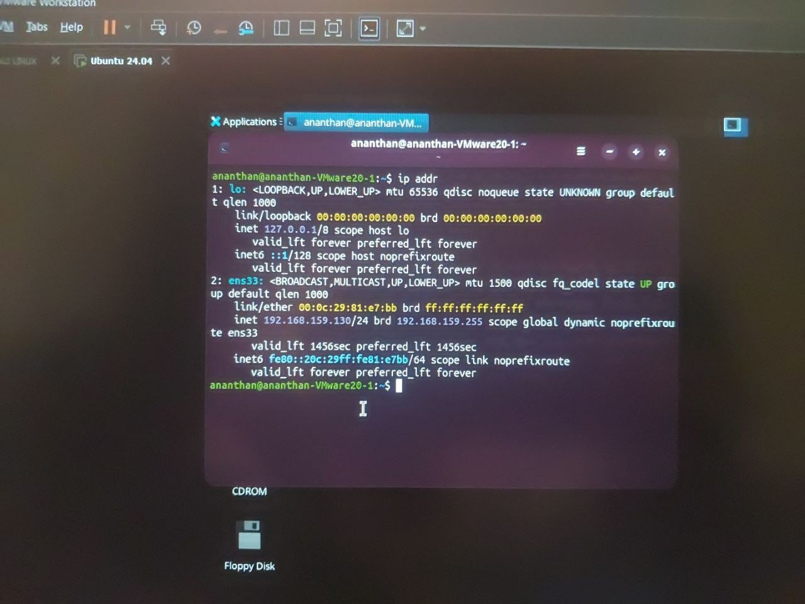

---

# Step 2 - Verify Kali Linux IP Address

Command

```bash
ip addr
```

Purpose

Displays Kali Linux network configuration.

Result

Kali Linux was assigned the IP address **192.168.159.129**.

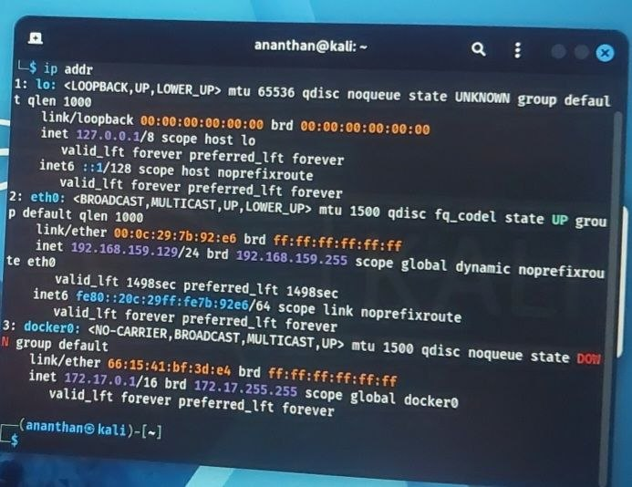

---

# Step 3 - Verify Network Connectivity

Before configuring remote access, connectivity between the Ubuntu target machine and the Kali attacker machine was verified using the `ping` command.

## 3.1 Ping from Ubuntu to Kali

Command

```bash
ping 192.168.159.129
```

Purpose

Tests network connectivity from the Ubuntu target machine to the Kali Linux attacker machine.

Result

Ubuntu successfully communicated with Kali Linux. The responses confirmed that both virtual machines were connected to the same NAT network and could exchange packets.

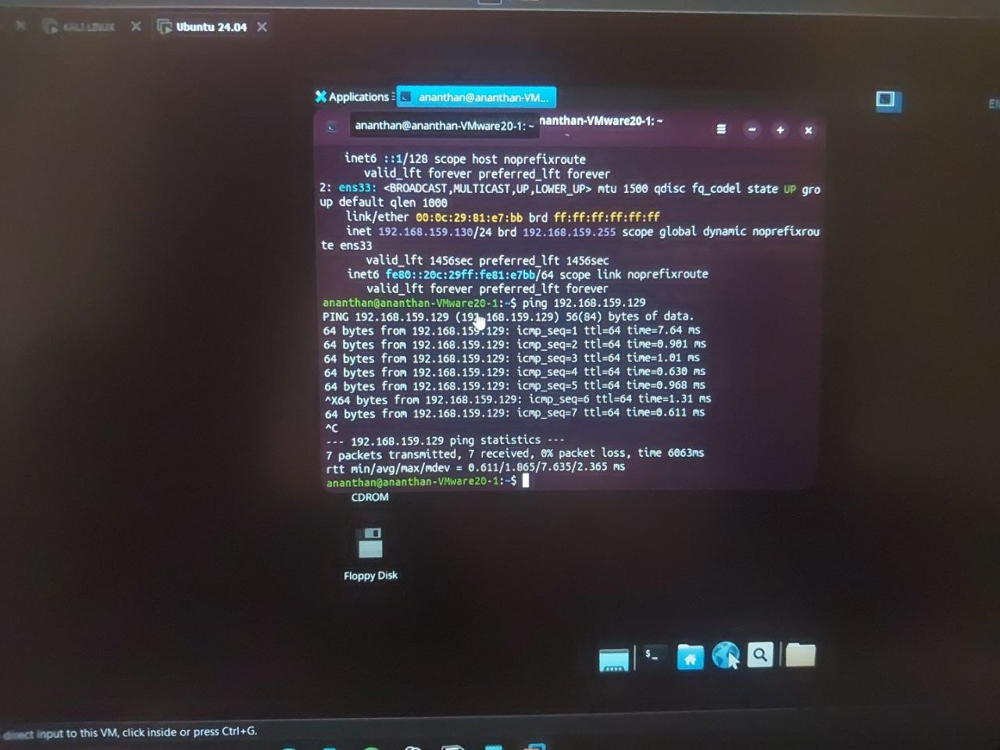

---

## 3.2 Ping from Kali to Ubuntu

Command

```bash
ping 192.168.159.130
```

Purpose

Verifies network communication from Kali Linux to the Ubuntu target machine.

Result

Kali successfully reached the Ubuntu machine with no packet loss, confirming two-way communication between both systems.

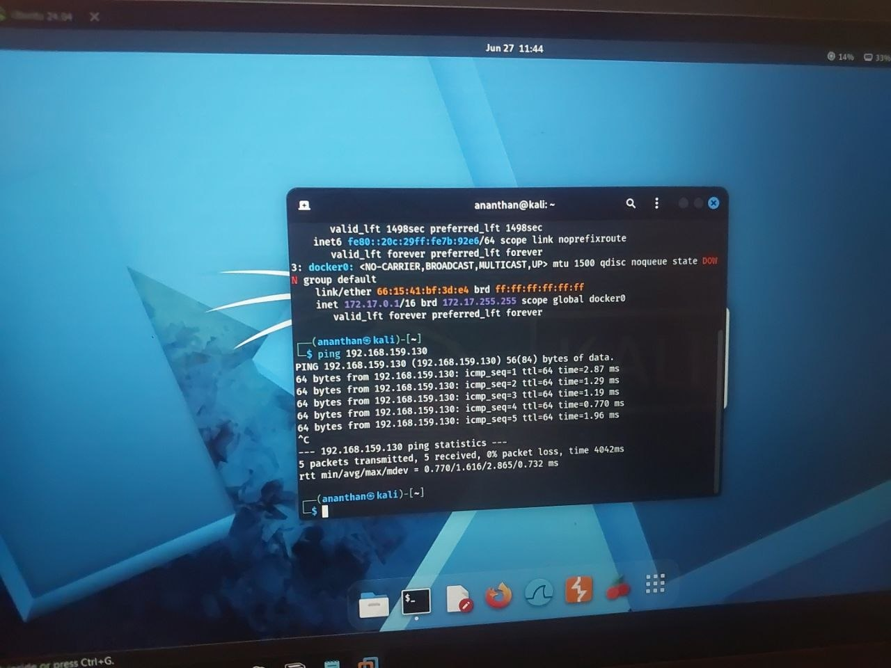

---

# Step 4 - Install OpenSSH Server

SSH is one of the most widely used protocols for secure remote administration. Before performing authentication log analysis, the OpenSSH Server was installed on the Ubuntu virtual machine.

## Update Package Repository

Command

```bash
sudo apt update
```

Purpose

Updates the package repository to ensure the latest software versions are available.

---

## Initial Installation Attempt

Command

```bash
sudo apt install openssh-server-y
```

Observation

The installation failed because the command syntax was incorrect. The `-y` option must be separated by a space.

This highlights the importance of proper command syntax when administering Linux systems.

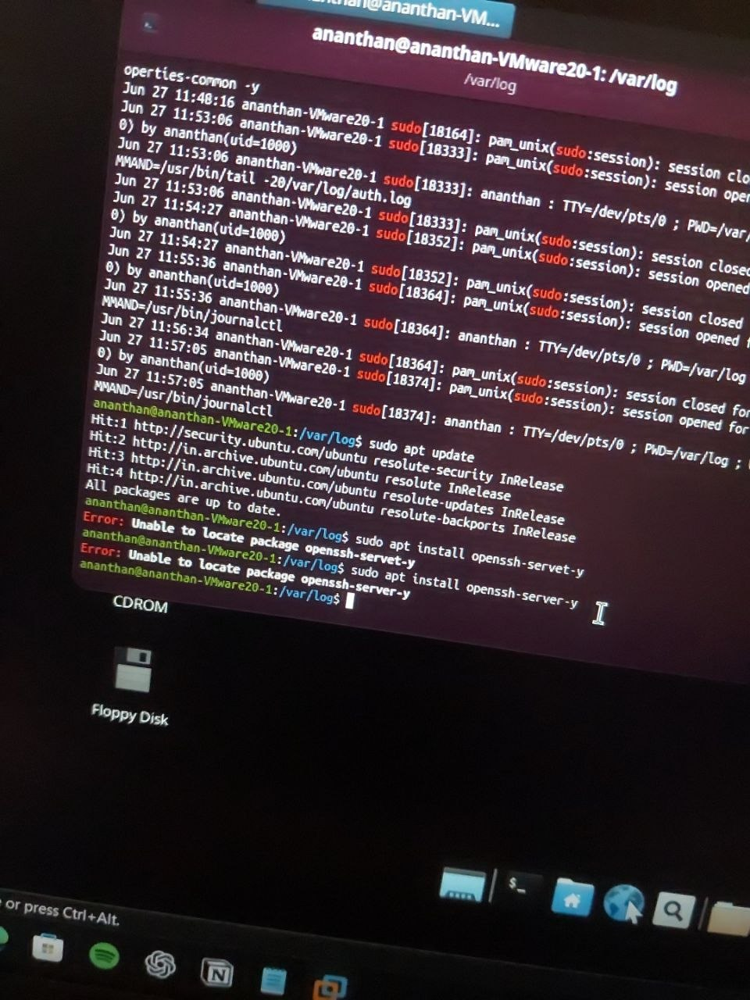

---

## Successful Installation

Correct Command

```bash
sudo apt install openssh-server -y
```

Purpose

Installs the OpenSSH Server package along with all required dependencies.

Result

The package was installed successfully, enabling the Ubuntu machine to provide secure remote SSH access.


---

# Step 5 - Verify SSH Service Status

After installation, the SSH service was checked to verify whether it was running correctly.

## Initial Service Status

Command

```bash
sudo systemctl status ssh
```

Observation

The service was installed but inactive.

Status

- Loaded: Yes
- Active: Inactive (dead)

This is expected before manually starting the SSH service.

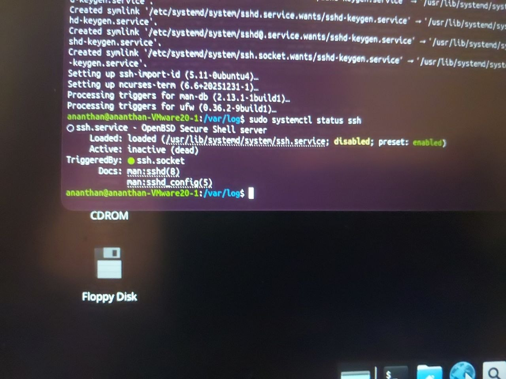

---

## Start and Enable SSH Service

Commands

```bash
sudo systemctl start ssh
sudo systemctl enable ssh
```

Purpose

- Starts the SSH service immediately.
- Configures the service to start automatically during system boot.

---

## Verify Active Status

Command

```bash
sudo systemctl status ssh
```

Result

The SSH service was successfully started and was now running.

Status

- Loaded: Enabled
- Active: Running

The Ubuntu machine was now ready to accept remote SSH connections.

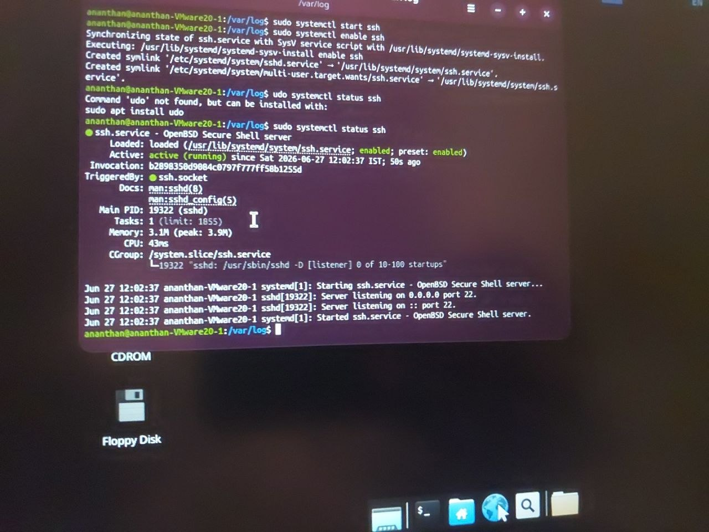

---

# Step 6 - Explore Linux Log Files

Linux stores system and application logs in the `/var/log` directory. These logs are an essential source of evidence for troubleshooting and security investigations.

## View Log Directory

Command

```bash
cd /var/log
ls -lh
```

Purpose

Displays the contents of the Linux log directory and identifies important log files used during investigations.

Important log files observed:

- auth.log
- syslog
- kern.log
- boot.log
- dpkg.log
- journal/

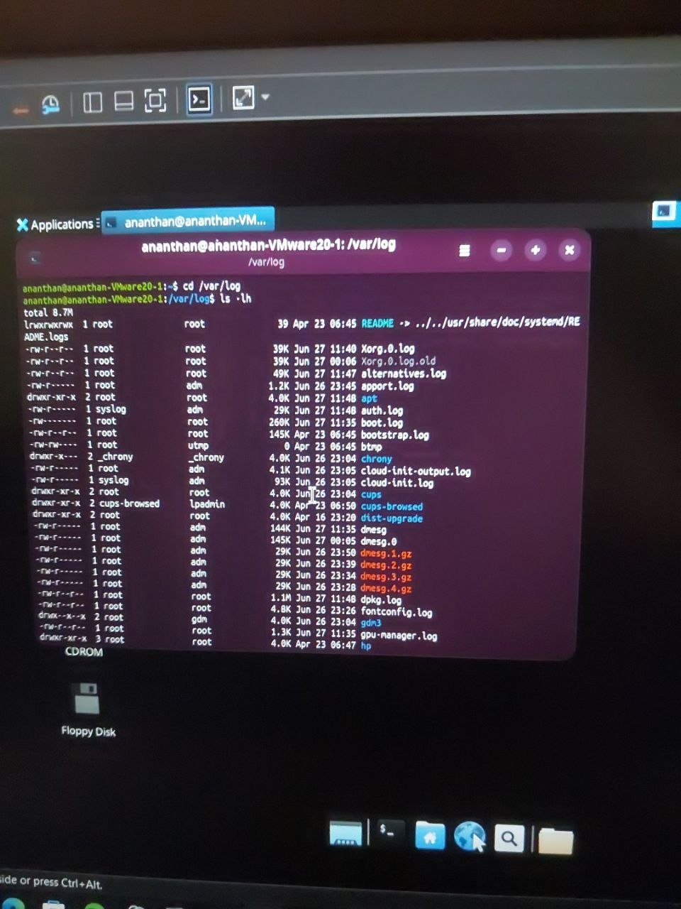

Additional log files:

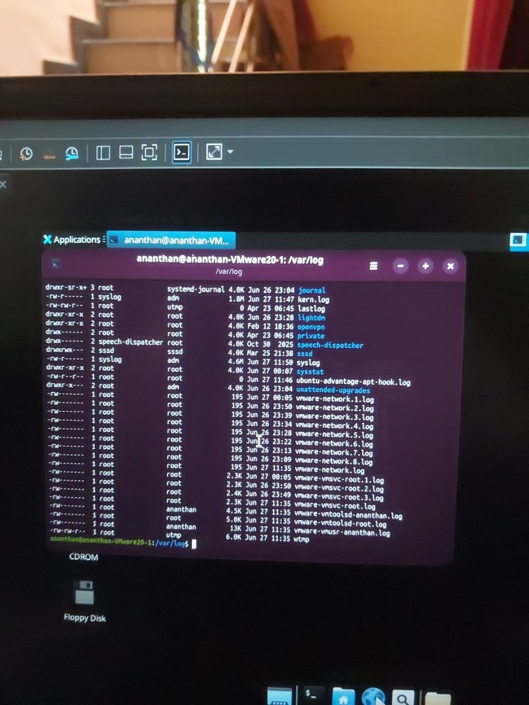

---

# Step 7 - Troubleshooting Log Analysis

While attempting to read the authentication log, an incorrect command syntax was used.

Command

```bash
sudo tail -20/var/log/auth.log
```

Result

The command failed because there was no space between the option and the file path.

Error

```text
tail: option used in invalid context
```

Correct command

```bash
sudo tail -20 /var/log/auth.log
```

This highlighted the importance of command syntax during Linux administration.

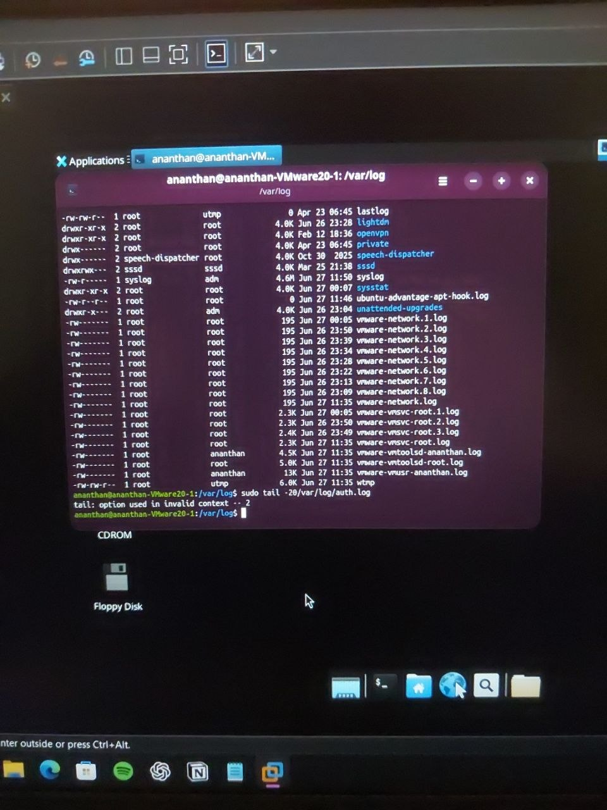

---

# Step 8 - Analyze System Logs Using journalctl

Modern Ubuntu systems store logs using the systemd journal.

Command

```bash
sudo journalctl
```

Purpose

Display system logs, kernel messages, boot events, and service logs maintained by systemd.

Observation

The output included:

- Kernel initialization
- System startup
- Hardware detection
- Service startup messages

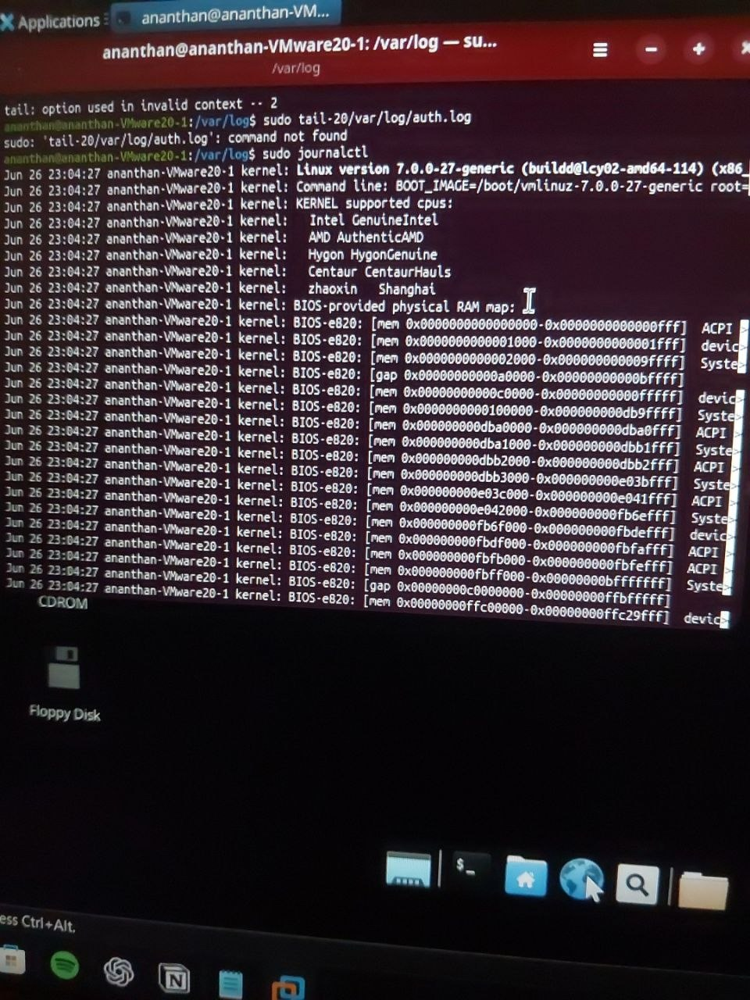

---

# Step 9 - Investigate Sudo Authentication Events

To identify privileged actions, the system journal was filtered for sudo events.

Command

```bash
sudo journalctl | grep sudo
```

Observation

The logs showed:

- User executing sudo commands
- Session opened
- Session closed
- Executed administrative commands

These logs help identify privileged activity during security investigations.

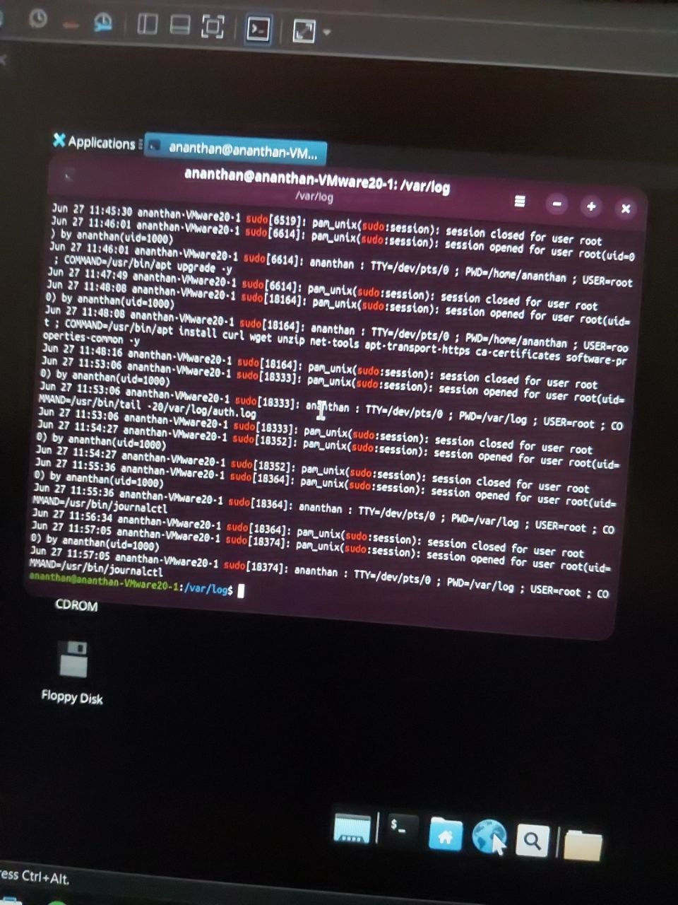

---

# Step 10 - Simulate an SSH Authentication Attack

An SSH connection was initiated from the Kali Linux virtual machine to the Ubuntu target.

Command

```bash
ssh ananthan@192.168.159.130
```

Multiple incorrect passwords were intentionally entered to generate authentication failures.

Purpose

Simulate a basic brute-force authentication attempt and generate security events for investigation.

---

# Step 11 - Investigate Failed SSH Login Attempts

Command

```bash
sudo journalctl | grep sshd
```

Observation

The investigation identified:

- Failed password attempts
- Source IP address
- Authentication failures
- PAM authentication messages
- Connection termination

The logs confirmed that authentication failures originated from the Kali Linux machine.

Evidence

- Source IP: **192.168.159.129**
- Target User: **ananthan**
- Service: **OpenSSH**
- Port: **22**

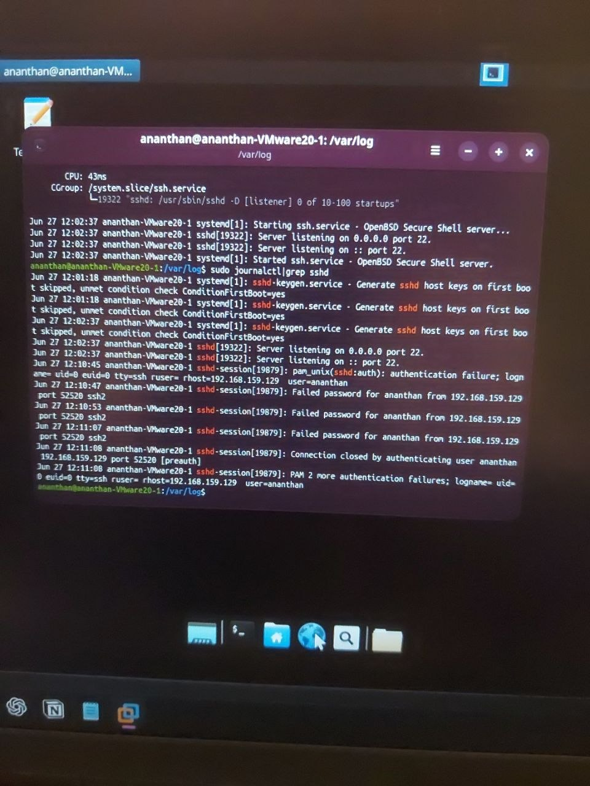

---

# Step 12 - Verify System Resources

Commands

```bash
free -h
df -h
```

Purpose

Verify available memory and disk space before deploying additional services.

Observation

The Ubuntu virtual machine had sufficient resources available for the current lab environment.

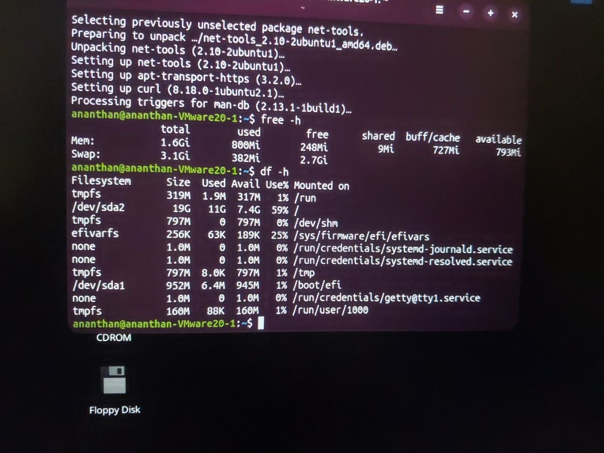

---

# Step 13 - Monitor Running Processes

Command

```bash
htop
```

Purpose

Display real-time CPU, memory usage, and active processes.

Observation

The Ubuntu system was operating normally with low CPU utilization and acceptable memory usage.

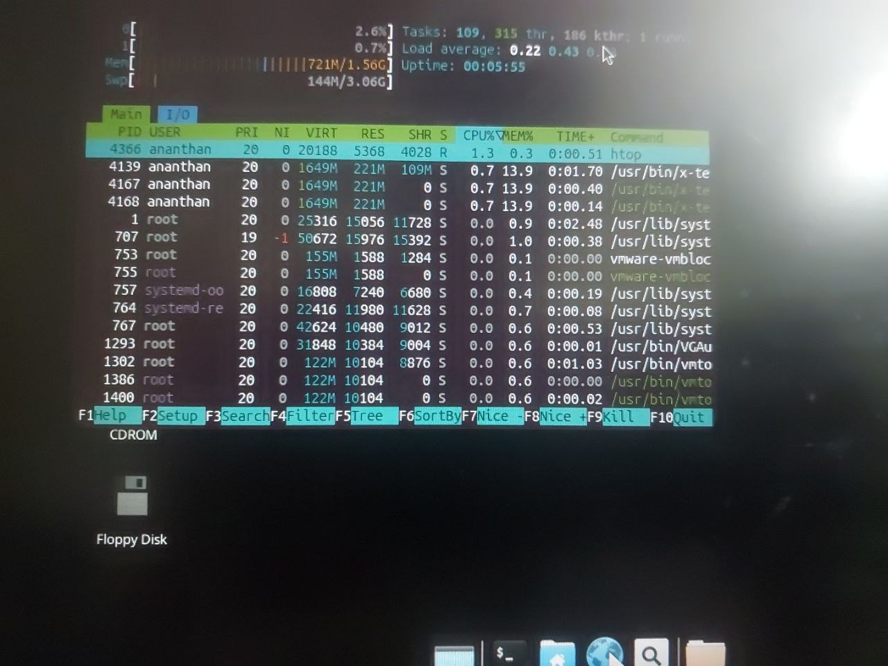

---

# Key Findings

- Successfully configured Ubuntu and Kali Linux virtual machines.
- Verified network communication between both systems.
- Installed and configured the OpenSSH Server.
- Generated authentication events through failed SSH login attempts.
- Investigated Linux system logs using `journalctl`.
- Identified the attacker IP address through authentication logs.
- Verified system health and available resources.

---

# Skills Demonstrated

- Linux Administration
- Network Troubleshooting
- SSH Configuration
- Linux Log Analysis
- Authentication Investigation
- Service Management
- Incident Investigation
- SOC Fundamentals

---

# MITRE ATT&CK Mapping

| Technique | ID |
|-----------|----|
| Valid Accounts | T1078 |
| Brute Force | T1110 |
| Remote Services (SSH) | T1021.004 |

---

# Lessons Learned

During this lab I learned:

- How Linux stores authentication logs.
- How to configure the OpenSSH service.
- How to investigate SSH authentication events.
- The importance of correct command syntax.
- How to analyze privileged activity using `journalctl`.
- How SOC analysts identify suspicious login attempts.

---

# Future Improvements

- Install Wazuh SIEM
- Deploy Wazuh Agent
- Create SSH detection rules
- Simulate automated brute-force attacks
- Build alert dashboards
- Investigate attacks using SIEM

---

# Conclusion

This lab introduced the fundamentals of Linux log analysis and SSH security monitoring within a controlled virtual environment.

By configuring Ubuntu as a target system and Kali Linux as an attacker, I gained hands-on experience with network verification, Linux administration, SSH service management, and security log analysis. The investigation of failed SSH login attempts demonstrated how authentication events are recorded and how they can be used to identify suspicious activity.

This project serves as the foundation for future SOC Home Lab exercises involving Wazuh SIEM, centralized log collection, threat detection, and incident response.
